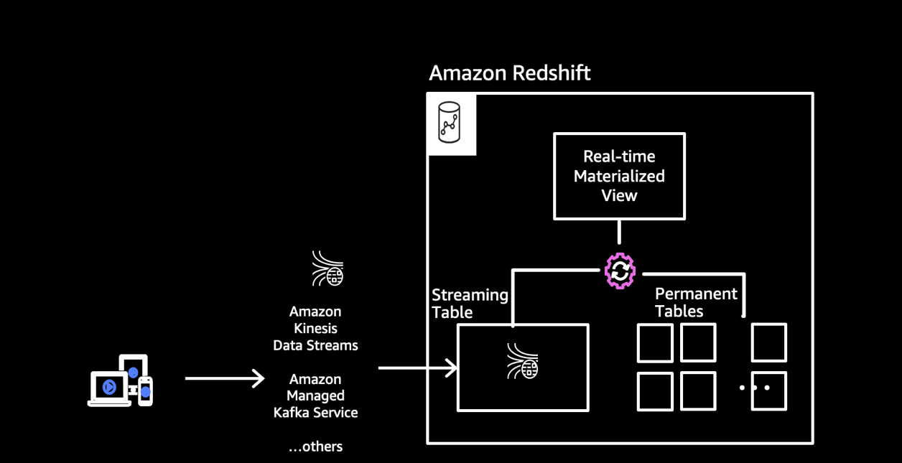
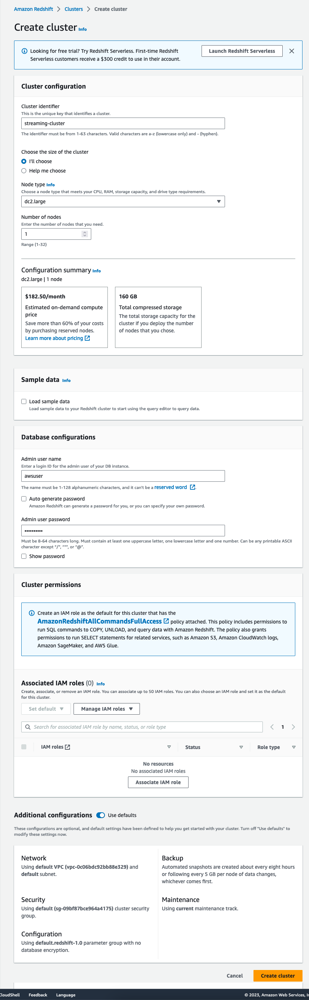
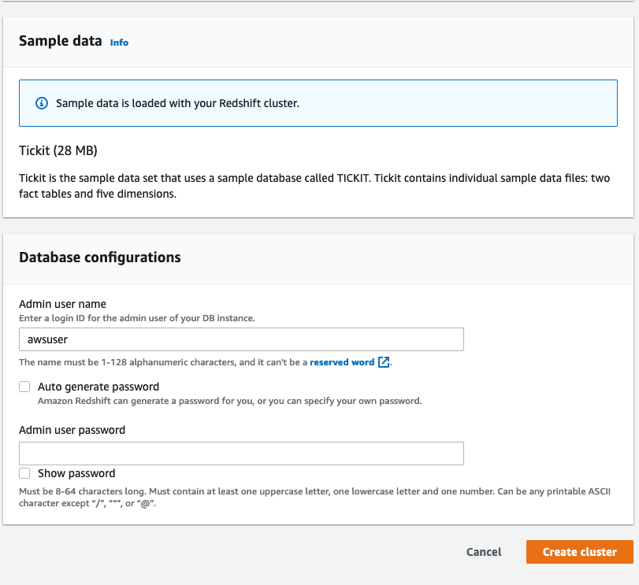
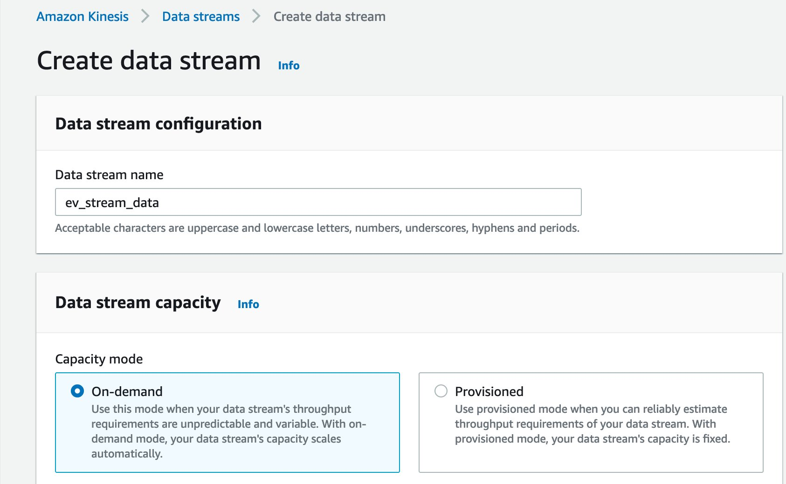
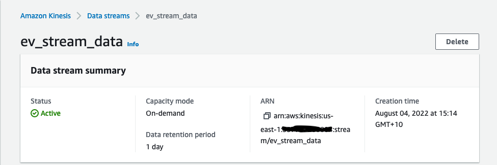
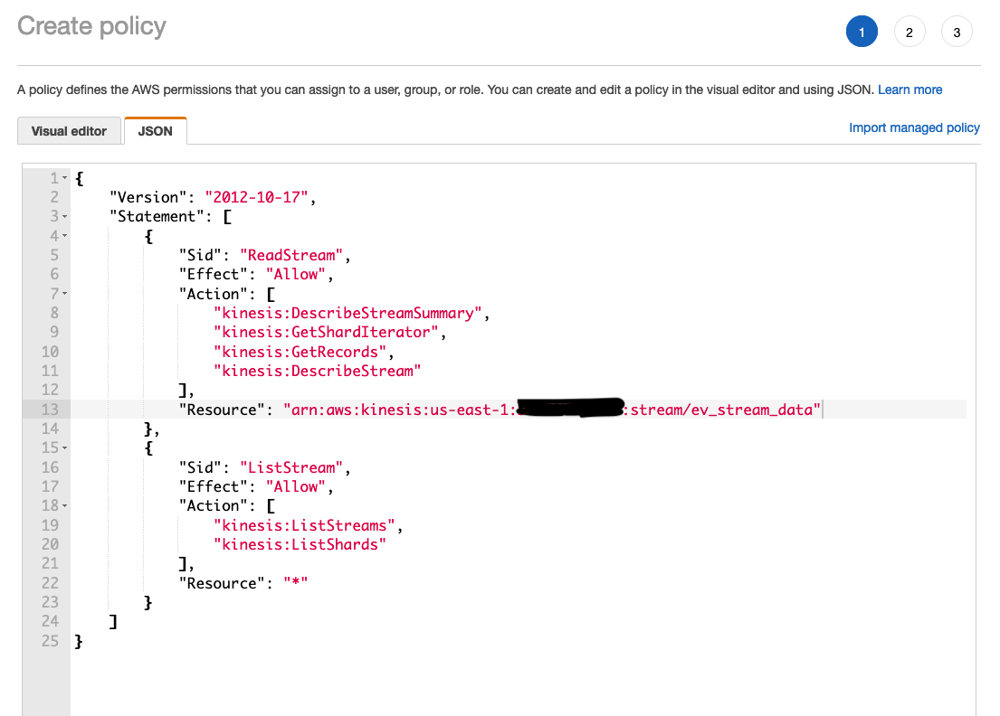
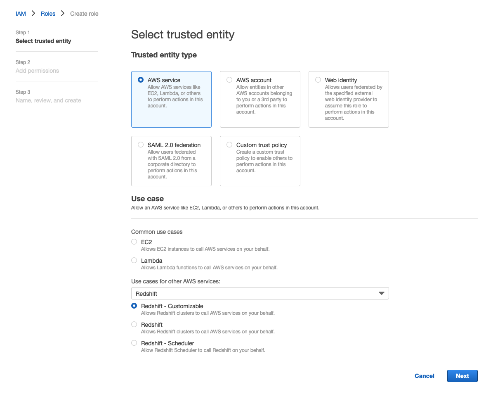
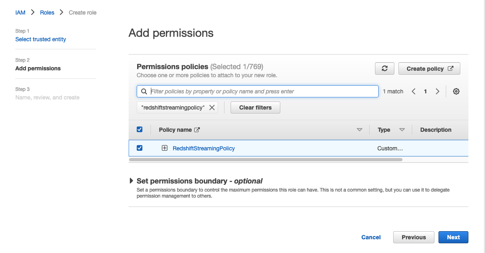
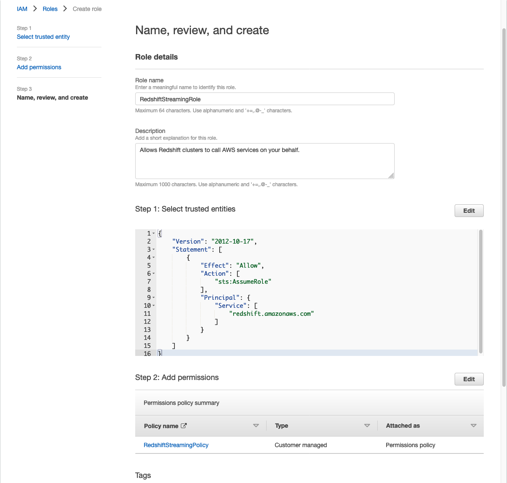
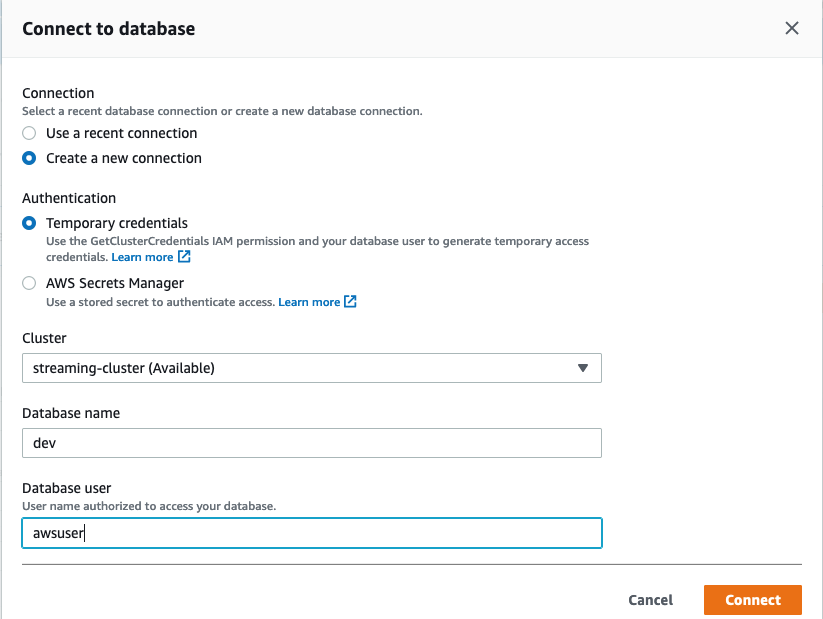

# Real-Time Analytics with Amazon Redshift Streaming Ingestion

This lab is provided as part of **[AWS Innovate Data Edition](https://aws.amazon.com/events/aws-innovate/data/)**,  it has been adapted from the [blog post](https://aws.amazon.com/blogs/big-data/real-time-analytics-with-amazon-redshift-streaming-ingestion/).

ℹ️ You will run this lab in your own AWS account and running this lab will incur some costs. Please follow directions at the end of the lab to remove resources to avoid future costs.

## Table of Contents  
* [Overview](#overview)  
* [Architecture](#architecture)  
* [Create RedShift Cluster](#create-redshift-cluster)  
* [Create Kinesis Data Stream](#create-kinesis-data-stream)  
* [Create IAM Role](#create-iam-role-to-allow-redshift-to-communicate-with-kinesis-data-stream)
* [Associate IAM Role with the Redshift cluster](#associate-iam-role-with-the-redshift-cluster)
* [Create Kinesis Data Generator](#create-kinesis-data-generator)
* [Sending Data from Kinesis Data Generator](#sending-data-from-kinesis-data-generator)
* [Consume Data From Kinesis Data Stream](#consume-data-from-kinesis-data-stream)
* [Cleanup](#cleanup)
* [Conclusion](#conclusion)
* [Survey](#survey)

## Overview
Previously, loading data from a streaming service like Amazon Kinesis Streams into Amazon Redshift included several steps. These included connecting the stream to an Amazon Kinesis Data Firehose and waiting for Kinesis Data Firehose to stage the data in Amazon S3, using various-sized batches at varying-length buffer intervals. After this, Kinesis Data Firehose triggered a COPY command to load the data from Amazon S3 to a table in Redshift. 

Amazon Redshift streaming ingestion allows you to connect to Kinesis Data Streams directly, without the latency and complexity associated with staging the data in Amazon S3 and loading it into the cluster. You can now connect to and access the data from the stream using SQL and simplify your data pipelines by creating materialized views directly on top of the stream. The materialized views can also include SQL transforms as part of your ELT (extract, load and transform) pipeline.

Amazon Redshift is a stream consumer. An Amazon Redshift materialized view is the landing area for data that is read from the stream, which is processed as it arrives. For instance, JSON values can be consumed and mapped to Redshift data columns using SQL, which is familiar. When the materialized view is refreshed, Redshift compute nodes allocate each data shard to a compute slice. Each slice consumes data from the allocated shards until the view reaches parity with the stream. In the same manner, subsequent materialized view refreshes read data from the last SEQUENCE_NUMBER of the previous refresh until it reaches parity with the stream data. 

In this post, we walk through the steps to create a Kinesis data stream, generate and load streaming data, create a materialized view, and query the stream to visualize the results

## Architecture


## Create RedShift Cluster
1. Navigate to the [Amazon Redshift](https://us-east-1.console.aws.amazon.com/redshiftv2/) service in the AWS Console.
1. Click on create cluster and name the cluster ``streaming-cluster``.
1. You could choose the **Free Trial** option.        
1. Enter a password in **Admin user password** and take note of this
1. Click on **Create Cluster**.





## Create Kinesis Data Stream
1. Navigate to [**Amazon Kinesis console**](https://us-east-1.console.aws.amazon.com/kinesis/home?region=us-east-1#/streams)
1. Choose **Create data stream**.
1. For **Data stream name**, enter ```ev_stream_data```.
1. For Capacity mode, select On-demand and click **Create Data Stream**

1. Take note of the resource ARN, you will need it for the next step
 

## Create IAM Role To Allow Redshift To Communicate With Kinesis Data Stream
1. Open the [IAM Console](https://us-east-1.console.aws.amazon.com/iamv2/home#/home)
1. Select **Policies** and click **Create policy**
1. Copy the IAM policy below to JSON editor. Replace the resource arn with your Kinesis Stream ARN created in the previous step.
    ```
    {
        "Version": "2012-10-17",
        "Statement": [
            {
                "Sid": "ReadStream",
                "Effect": "Allow",
                "Action": [
                    "kinesis:DescribeStreamSummary",
                    "kinesis:GetShardIterator",
                    "kinesis:GetRecords",
                    "kinesis:DescribeStream"
                ],
                "Resource": "arn:aws:kinesis:*:0123456789:stream/*" [Replace this with your Kinesis Data Stream ARN]
            },
            {
                "Sid": "ListStream",
                "Effect": "Allow",
                "Action": [
                    "kinesis:ListStreams",
                    "kinesis:ListShards"
                ],
                "Resource": "*"
            }
        ]
    }
    ```
 

5. Name the policy as **RedshiftStreamingPolicy** and click **Create Policy**

6. Select **Roles** and click **Create role**. Follow the step below to create an IAM role with a trust policy (**RedshiftStreamingPolicy** created above) that allows your Amazon Redshift cluster to assume the role. 

7. Name the role **RedshiftStreamingRole**
 
 
 

##  Associate IAM Role with the Redshift cluster.
Please wait until the Redshift Cluster Status is **Available** before proceeding
1. Navigate to the [Amazon Redshift](https://us-east-1.console.aws.amazon.com/redshiftv2/) service in the AWS Console. 
1. On the navigation menu, choose **streaming-cluster**
1. For Actions, choose Manage IAM roles to display the current list IAM roles associated with the cluster. 
1. On the Manage IAM roles page, choose **RedshiftStreamingRole**, and then choose **Associate IAM role**.
1. Choose **Save Changes**

## Create Kinesis Data Generator
1. Click [here](https://console.aws.amazon.com/cloudformation/home?region=us-east-1#/stacks/new?stackName=Kinesis-Data-Generator-Cognito-User&templateURL=https://aws-kdg-tools.s3.us-west-2.amazonaws.com/cognito-setup.json) to start with the CloudFormation stack creation screen. 
Kinesis Data Generator uses a service called Amazon Cognito at the backend for login authentication and authorization of log sending permissions. 
By creating this CloudFormation stack, you can create the necessary Cognito resources.
1. In **"Step 1: Specify template"**, make sure that the Amazon S3 URL where the template source is located has already entered. Click **[Next]** without any changes.
1. In **"Step 2: Specify stack details"**, enter the appropriate value for **"Username"** and **"Password"** for **"Kinesis Data Generator"**. The username and password specified here will be used to log in to Kinesis Data Gnerator later. Once you have entered, click **[Next]**.
1. In **"Step 3: Configure stack options"**, click **[Next]** without any changes.
1. In **"Step 4: Review"**, check the check-box of **"I acknowledge that AWS CloudFormation might create IAM resources with custom names "** at to bottom of the screen, and then click **[Create stack]** button to start the stack creation.
1. Wait for a few minutes until the stack status changes  CREATE_COMPLETE.

## Sending Data from Kinesis Data Generator
1. Choose **[Output]** tab of the CloudFormation stack you have created. You can open the setting screen of Kinesis Data Generator by clicking the URL of **"KinesisDataGeneratorUrl"** displayed.
1. Enter the user name and password you have created in the the above step to **"Username"** and **"Password"** in the top right of the screen, and then login to it.
1. Configure the log transfer setting actually in this step. In **"Region"**, choose **[-east-1]** ( N. Virginia region), and then choose ```ev-stream-data``` you have created earlier in **Stream/delivery stream**.
1. Enter **"5"** to **Records per second** (the number of log records generated per second). This means that 5 records are created per 1 second. As a result 300 records are generated in one minute, and then sent to Firehose.
1. In **"Record template"** below, copy and paste the following codes into **Templete 1** field. This specifies the format for logging sent from clients. It automatically generates dummy log data using such as random numbers.
   ```
   { 
    "_id" : "{{random.uuid}}",
    "clusterID": "{{random.number(
            {   "min":1,
                "max":50
            }
        )}}", 
        "connectionTime": "{{date.now("YYYY-MM-DD HH:mm:ss")}}",
        "kWhDelivered": "{{commerce.price}}",
        "stationID": "{{random.number(
            {   "min":1,
                "max":467
            }
        )}}",
        "spaceID": "{{random.word}}-{{random.number(
            {   "min":1,
                "max":20
            }
        )}}",
    
    "timezone": "America/Los_Angeles",
    "userID": "{{random.number(
            {   "min":1000,
                "max":500000
            }
        )}}"
    }
    ```
1. Click **[Send data]** button at last to start sending the data. The Data continues to be sent to Kinesis Data STream until you click [Stop Sending Data to Kinesis] displayed in the pop-up menu or close the browser tab.

## Consume Data From Kinesis Data Stream
1. Navigate to the [Amazon Redshift Query Editor](https://us-east-1.console.aws.amazon.com/redshiftv2/home?region=us-east-1#query-editor:)
1. Choose **Connect To Database** and fill in the details to connect to **streaming-cluster**
 
1. Replace the IAM Role ARN with your **RedshiftStreamingRole** ARN in the command below. Execute it in the **Query Editor** to Create an external schema to map the data from Kinesis to a Redshift object.
    ```
    CREATE EXTERNAL SCHEMA evdata FROM KINESIS
    IAM_ROLE 'arn:aws:iam::0123456789:role/redshift-streaming-role';    
    ```
1. Create a materialized view to consume the stream data. This method will store stream records in semi-structured SUPER format. The JSON source is stored in Redshift without converting to Redshift types.
    ```
    CREATE MATERIALIZED VIEW ev_station_data AS
        SELECT approximatearrivaltimestamp,
        partitionkey,
        shardid,
        sequencenumber,
        json_parse(from_varbyte(data, 'utf-8')) as payload    
        FROM evdata."ev_stream_data";
    ```
1. Refresh the materialized view
    ```
    REFRESH MATERIALIZED VIEW ev_station_data;
    ```
1. Query the refreshed materialized view.
    ```
    select * from ev_station_data;
    ```
1. Now we can try another method to define schema in Redshift. The materialized view is distributed on the UUID value from the stream and is sorted by the approximatearrivaltimestamp value.
    ```
    CREATE MATERIALIZED VIEW ev_station_data_extract DISTKEY(5) sortkey(1) AS
    SELECT approximatearrivaltimestamp,
    partitionkey,
    shardid,
    sequencenumber,
    json_extract_path_text(from_varbyte(data, 'utf-8'),'_id')::character(36) as ID,
    json_extract_path_text(from_varbyte(data, 'utf-8'),'clusterID')::varchar(30) as clusterID,
    json_extract_path_text(from_varbyte(data, 'utf-8'),'connectionTime')::varchar(20) as connectionTime,
    json_extract_path_text(from_varbyte(data, 'utf-8'),'kWhDelivered')::DECIMAL(10,2) as kWhDelivered,
    json_extract_path_text(from_varbyte(data, 'utf-8'),'stationID')::DECIMAL(10,2) as stationID,
    json_extract_path_text(from_varbyte(data, 'utf-8'),'spaceID')::varchar(100) as spaceID,
    json_extract_path_text(from_varbyte(data, 'utf-8'),'timezone')::varchar(30) as timezone,
    json_extract_path_text(from_varbyte(data, 'utf-8'),'userID')::varchar(30) as userID
    FROM evdata."ev_stream_data";
    ```

    ```
    REFRESH MATERIALIZED VIEW ev_station_data_extract;
    ```
1. Query the refreshed materialized view to get usage statistics.
    ```
    SELECT to_timestamp(connectionTime, 'YYYY-MM-DD HH24:MI:SS') as connectiontime
    ,SUM(kWhDelivered) AS Energy_Consumed 
    ,count(distinct userID) AS #Users
    from ev_station_data_extract
    group by  to_timestamp(connectionTime, 'YYYY-MM-DD HH24:MI:SS')
    order by 1 desc;
    ```

## Cleanup
Follow the below steps to cleanup your account to prevent any aditional charges:
* Navigate to the [Amazon Redshift](https://us-east-1.console.aws.amazon.com/redshiftv2/). Choose **streaming-cluster**, **Action -> Delete**
* Navigate to [Amazon Kinesis Data Streams](https://us-east-1.console.aws.amazon.com/kinesis/home?region=us-east-1#/streams/list) and delete **ev_stream_data**
* Navigate to [CloudFormation] and find the stack **Kinesis-Data-Generator-Cognito-User** and **Delete**

## Conclusion
Throughout the lab, you've learnt how to connect to Kinesis Data Streams directly, without the latency and complexity by using Amazon Redshift Streaming

[Streaming ingest and stream processing](https://docs.aws.amazon.com/wellarchitected/latest/analytics-lens/streaming-data-processing.html) is one of the scenarios in the [Well-Architected Framework Data Analytics Lens](https://docs.aws.amazon.com/wellarchitected/latest/analytics-lens/analytics-lens.html)

We highly recommend you to deep dive the [Well-Architected Data Analytics Lens](https://docs.aws.amazon.com/wellarchitected/latest/analytics-lens/analytics-lens.html) to understand the pros and cons of decisions while building analytics systems and workloads on AWS.

## Survey
Let us know what you thought of this session and how we can improve the presentation experience for you in the future by completing this [event session poll](https://amazonmr.au1.qualtrics.com/jfe/form/SV_1U4cxprfqLngWGy?Session=HOL01). Participants who complete the surveys from AWS Innovate Online Conference will receive a gift code for USD25 in AWS credits1, 2 & 3. AWS credits will be sent via email by September 29, 2023.
Note: Only registrants of AWS Innovate Online Conference who complete the surveys will receive a gift code for USD25 in AWS credits via email.

<sup>1</sup>AWS Promotional Credits Terms and conditions apply: https://aws.amazon.com/awscredits/ 

<sup>2</sup>Limited to 1 x USD25 AWS credits per participant.

<sup>3</sup>Participants will be required to provide their business email addresses to receive the gift code for AWS credits.
